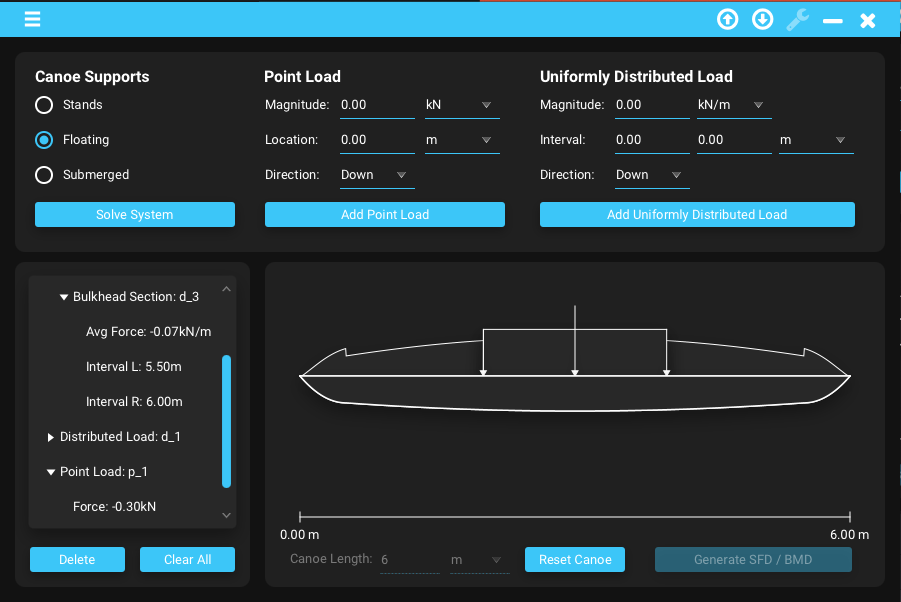
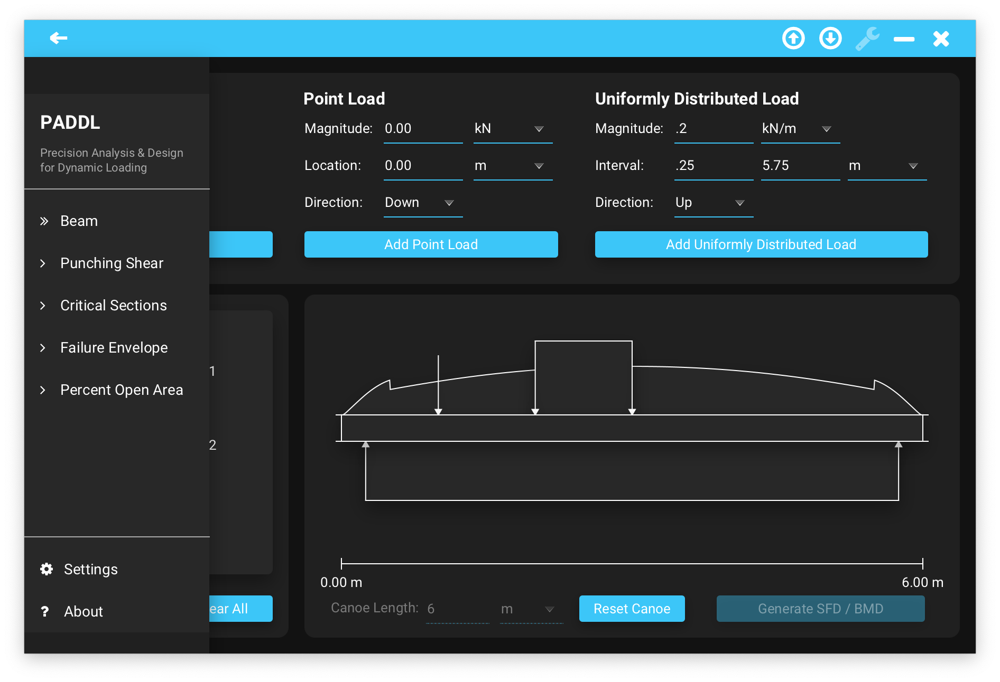
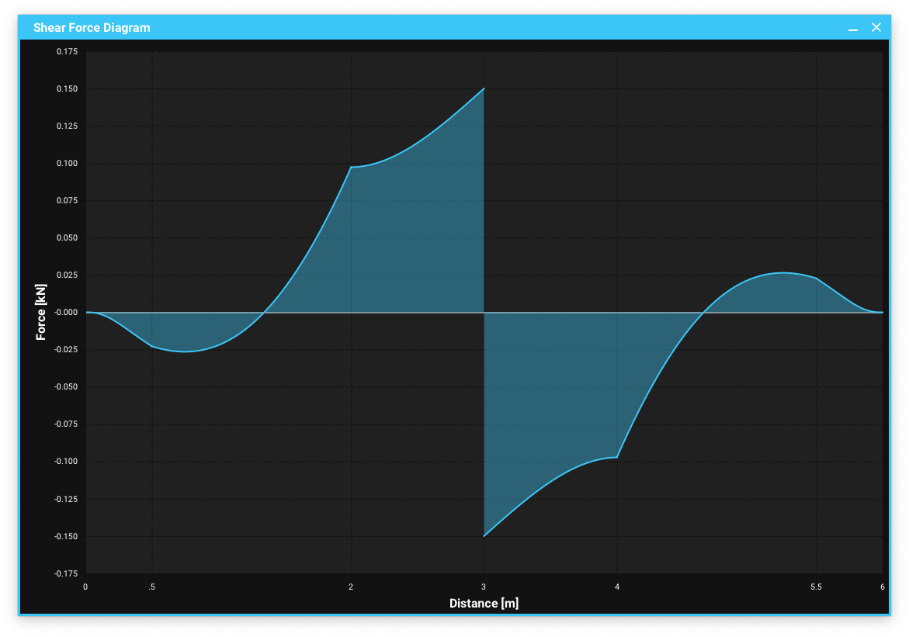
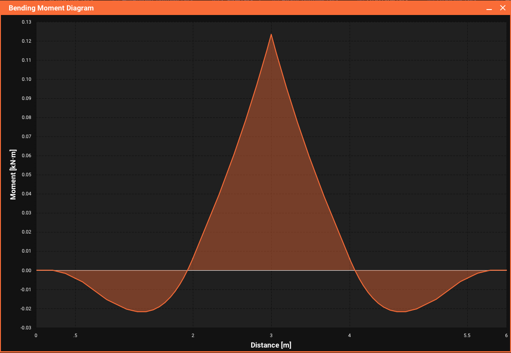

# PADDL

## About
PADDL, Precision Analysis & Design for Dynamic Loading, is a JavaFx desktop app built to simplify technical civil engineering design and analysis. The primary goal of the project is to implement effective UI/UX design to lower the barrier of technical knowledge required to make informed, analytical civil engineering decisions in less time.

<div style="display: flex; flex-direction: row;">
    
    
    <br>
    
    
</div>

PADDL is built as a custom software solution for [WECCA](https://wecca.org/), the Western Engineering Concrete Canoe Association, as a candidate for our 2025 EFA (Enhanced Focus Area). PADDL's modules are designed specifically as solutions to aid civil engineering processes specifically centered around WECCA's concrete canoe.

Currently, the program has one module to solve for the canoe's internal shear force and bending moment distributions. There are intentions for the project to grow in size over the next couple of years, where it will become increasingly more useful for WECCA over time.

### Summer '24 goals:
- Fully customizable canoe hull geometry and material properties
- Mathematical models with calculus and structural engineering methodologies of the canoe
- Two Finished Scenarios to solve for the canoe's equilibrium
    - Stands Case: balance the canoe on stands at x = 0 & x = L with vertical reaction forces
    - Floating Case: numerically solve for a buoyancy load distribution at an equilibrium waterline
- Flexibility to change colors to meet different yearly themes
- Working with different units made easy
- Canoe model clearly displayed visually
- Mapping of the canoe model to a file to be downloaded & uploaded for sharing data between engineers
- Infrastructure to include other modules

- Finish: Deploy an executable, downloadable soon at [https://wecca.org/](https://wecca.org/)

### Long Term Goals:
- Grow to include club general members as casual contributors in the '24-'25 school year
- Develop the other 5 planned structural/concrete design modules with other contributors
- Implement more program wide settings and features for convenience across modules
- More R&D into more advanced structural analysis methods to expand modelling capabilities

## Setting up the Development Environment

1. <b>Clone the repo</b>
   ```sh
   git clone https://github.com/Tyler-Liquornik/canoe-analysis
   ```
2. <b>Build the project with Maven</b>
   ```
   maven clean install
   ```
3. <b>Install Scenebuilder</b> <br/>
   Even if you already had Scenebuilder installed, you cannot render certain JFoenix components with Scenebuilder 16+ <br/> <br/>
   
   On Windows, you can install it through chocolatey. <br/>
   If you haven't installed chocolatey before, you can do it by running a terminal as admin (right click > run as admin)
   ```
    @"%SystemRoot%\System32\WindowsPowerShell\v1.0\powershell.exe" -NoProfile -InputFormat None -ExecutionPolicy Bypass -Command "iex ((New-Object System.Net.WebClient).DownloadString('https://community.chocolatey.org/install.ps1'))" && SET "PATH=%PATH%;%ALLUSERSPROFILE%\chocolatey\bin"
   ```
   If you have chocolate already, skip to the installation step here
   ```
   choco install scenebuilder --version=15.0.1
   ```
   
   On Mac, you can install SceneBuilder directly from <br/>
   [https://download2.gluonhq.com/scenebuilder/15.0.1/install/mac/SceneBuilder-15.0.1.dmg](https://download2.gluonhq.com/scenebuilder/15.0.1/install/mac/SceneBuilder-15.0.1.dmg) <br/> <br/>
    
4. <b>Add JFoenix and FontAwesomeFX to Scenebuilder</b><br/>
   Download [JFoenix](https://jar-download.com/artifacts/com.jfoenix/jfoenix/9.0.10/source-code) and [FontAwesomeFX](https://jar-download.com/artifacts/de.jensd/fontawesomefx/8.2/source-code) </br> <br/>

   Add the jar files to Scenebuilder's library:

   <div style="display: flex; flex-direction: row;">
    
    
   </div>

   Add the jar files from the boxed link. The list should show JFoenix and Scenebuilder as shown. </br> <br/>

## Summer '24 Feature Development Roadmap

- [X] Implement material design look and feel
- [X] Side Menu Drawer
    - [X] Template links to other modules
    - [X] Settings utility window
    - [X] About Page
- [X] Animated error popups
- [X] Import/Export the canoe object to a from/to a file
- [X] Unification of color system between Java and CSS code
  - [X] Customizable colors in settings
  - [X] Persist color settings across sessions in a properties file
- [X] Solve the case of a floating canoe [Epic]
  - [X] Implement an improved model for breaking the canoe hull up into sections
    - [X] Define a set of curves for hull geometry
    - [X] Create new graphics for complex load distributions
    - [X] Create new graphics for the hull geometry
    - [X] Display the canoe model in a collapsable TreeView
  - [X] Iteratively solve for the waterline of a floating hull in equilibrium to get a buoyancy distribution
  - [X] Solve for a buoyancy load distribution based on the self-weight distribution of the hull
  - [X] Solve for a buoyancy load distribution including the hull and external loads
  - [X] Ensure the canoe does not tip or sink
     
<!-- CONTRIBUTING -->
## Contributing
Starting in September for the 2024-2025 school year, any WECCA members involved on the software team can contribute to PADDL!

1. Go into the directory where you cloned the project. For example, I keep my project on my desktop so: <br/>
   ```
   cd "C:\Users\tyler\OneDrive\Desktop\canoe-analysis"
   ```
2. Create your own personal branch (`git checkout -b branch-name`). Use your full name as the branch name separated with dashes (i.e. tyler-liquornik)
3. Stage your changes (`git add .`)
4. Commit your Changes (`git commit -m "write a commit message here"`). Ignore the `-b` if the branch has already been created.
5. Push your commit(s) (`git push origin branch-name`)
6. Open a pull request, and be ready to describe the feature implemented or bugfix and justify/explain your work in the comments
7. Wait for approval. You can send a message in the Slack channel to ask, or wait until meeting to discuss the pull request

<!-- CONTACT -->
## Contact

Tyler Liquornik: tyler.liquornik@gmail.com

Project Link: [https://github.com/Tyler-Liquornik/canoe-analysis](https://github.com/Tyler-Liquornik/canoe-analysis)

<!-- MARKDOWN LINKS & IMAGES (might use later) -->
<!-- https://www.markdownguide.org/basic-syntax/#reference-style-links -->
<!-- [contributors-shield]: https://img.shields.io/github/contributors/othneildrew/Best-README-Template.svg?style=for-the-badge
[contributors-url]: https://github.com/othneildrew/Best-README-Template/graphs/contributors
[forks-shield]: https://img.shields.io/github/forks/othneildrew/Best-README-Template.svg?style=for-the-badge
[forks-url]: https://github.com/othneildrew/Best-README-Template/network/members
[stars-shield]: https://img.shields.io/github/stars/othneildrew/Best-README-Template.svg?style=for-the-badge
[stars-url]: https://github.com/othneildrew/Best-README-Template/stargazers
[issues-shield]: https://img.shields.io/github/issues/othneildrew/Best-README-Template.svg?style=for-the-badge
[issues-url]: https://github.com/othneildrew/Best-README-Template/issues
[license-shield]: https://img.shields.io/github/license/othneildrew/Best-README-Template.svg?style=for-the-badge
[license-url]: https://github.com/othneildrew/Best-README-Template/blob/master/LICENSE.txt
[linkedin-shield]: https://img.shields.io/badge/-LinkedIn-black.svg?style=for-the-badge&logo=linkedin&colorB=555
[linkedin-url]: https://linkedin.com/in/othneildrew
[product-screenshot]: images/screenshot.png -->

<!-- 
These are VM options required to run PADDL prior to implementation of burningwave to manage the Java reflection API. 
I've included these here in case burningwave has future issues, however it's possible more options are required as PADDL is built up from the time of burningwave implementation

--add-opens=java.base/java.lang.reflect=ALL-UNNAMED --add-opens=java.base/java.lang=ALL-UNNAMED --add-opens java.base/java.lang.reflect=com.jfoenix  --add-exports javafx.controls/com.sun.javafx.scene.control.behavior=com.jfoenix

-->
