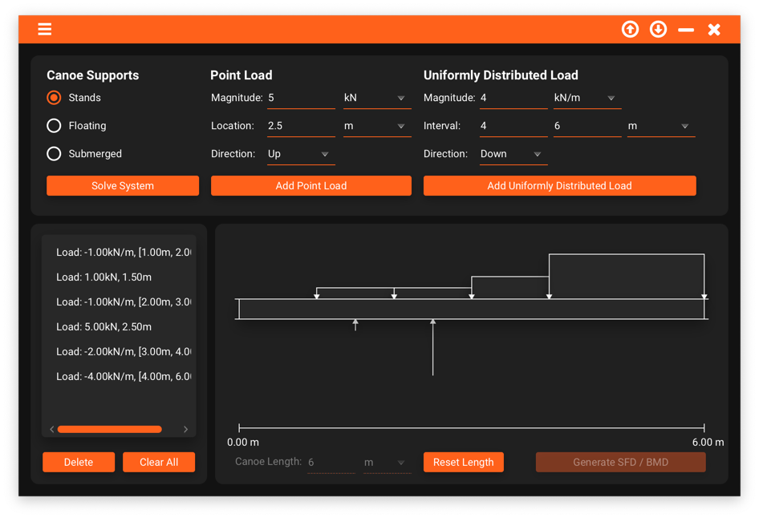
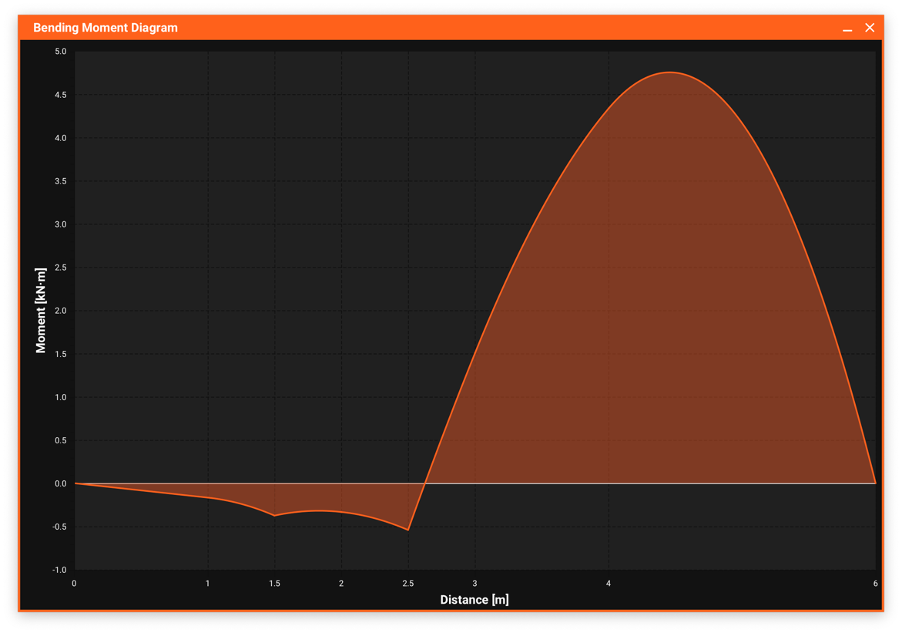
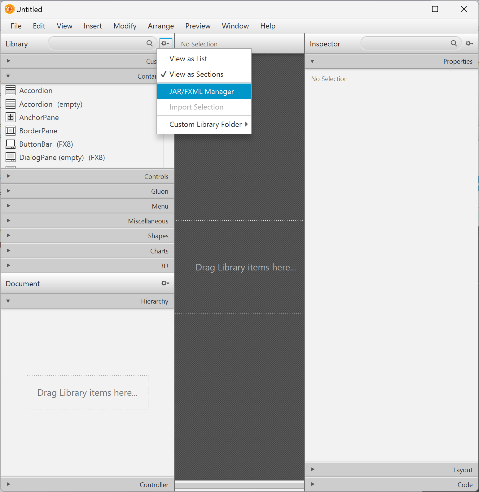
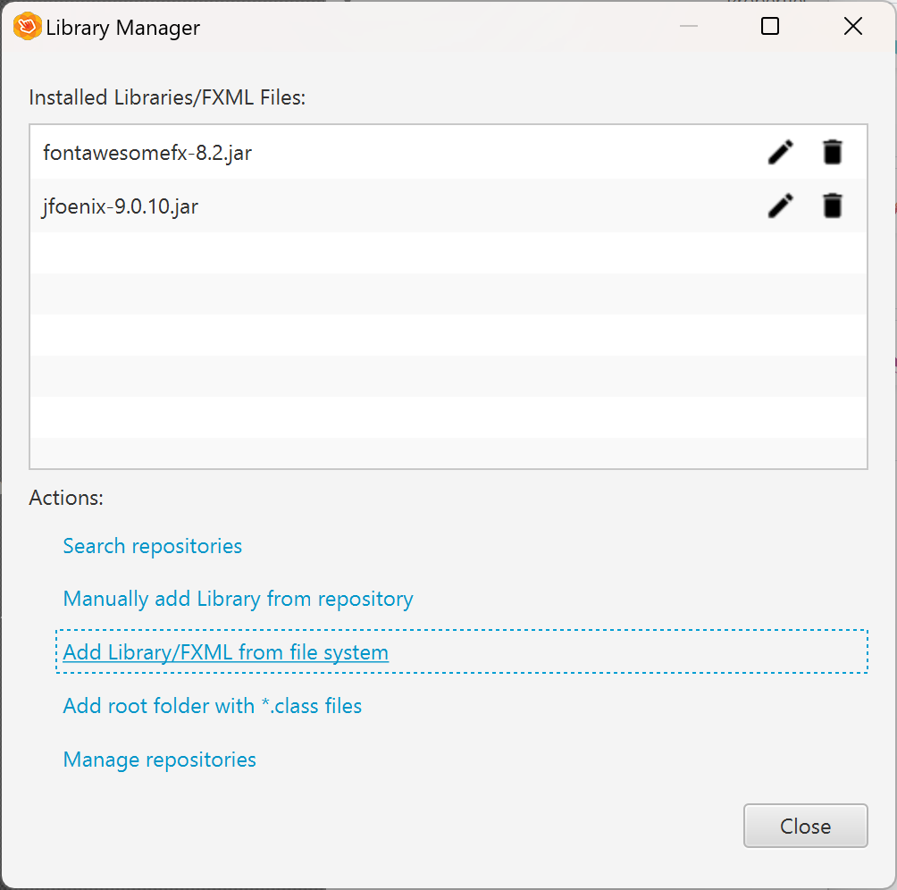

# PADDL

## About
PADDL, Precision Analysis & Design for Dynamic Loading is a JavaFx desktop app built to save the D&A team some hassle with tools to simplify technical civil engineering work. An emphasis is put on effective design to lower the barrier of technical civil engineering knowledge required to make informed, analytical civil engineering decisions in less time.

<div style="display: flex; flex-direction: row;">
    
    
</div>

PADDL is built as a custom software solution for [WECCA](https://wecca.org/), the Western Engineering Concrete Canoe Association as the subject of our EFA (Enhanced Focus Area) in accordance with the growing use of related software tools in industry.

Currently, the program has one module to which will be used to model the canoe as a beam (this is a standardized simplification) to solve for internal forces. This includes shear forces and bending moments.

## Setting up the Development Environment

1. <b>Clone the repo</b>
   ```sh
   git clone https://github.com/Tyler-Liquornik/canoe-analysis
   ```
2. <b>Build the project with Maven</b>
   ```
   maven clean install
   ```
3. <b>Install Scenebuilder</b> <br/>
   Even if you already had Scenebuilder installed, you cannot render certain JFoenix components with Scenebuilder 16+ <br/> <br/>
   
   On Windows, you can install it through chocolatey. <br/>
   If you haven't installed chocolatey before, you can do it by running a terminal as admin (right click > run as admin)
   ```
    @"%SystemRoot%\System32\WindowsPowerShell\v1.0\powershell.exe" -NoProfile -InputFormat None -ExecutionPolicy Bypass -Command "iex ((New-Object System.Net.WebClient).DownloadString('https://community.chocolatey.org/install.ps1'))" && SET "PATH=%PATH%;%ALLUSERSPROFILE%\chocolatey\bin"
   ```
   If you have chocolate already, skip to the installation step here
   ```
   choco install scenebuilder --version=15.0.1
   ```
   
   On Mac, you can install SceneBuilder directly from <br/>
   [https://download2.gluonhq.com/scenebuilder/15.0.1/install/mac/SceneBuilder-15.0.1.dmg](https://download2.gluonhq.com/scenebuilder/15.0.1/install/mac/SceneBuilder-15.0.1.dmg) <br/> <br/>
    
4. <b>Add JFoenix and FontAwesomeFX to scenebuilder</b><br/>
   Download [JFoenix](https://jar-download.com/artifacts/com.jfoenix/jfoenix/9.0.10/source-code) and [FontAwesomeFX](https://jar-download.com/artifacts/de.jensd/fontawesomefx/8.2/source-code) </br> <br/>

   Add the jar files to Scenebuilder's library:

   <div style="display: flex; flex-direction: row;">
    
    
   </div>

   Add the jar files from the boxed link. The list should show JFoenix and Scenebuilder as shown. </br> <br/>

## Roadmap

<b>Here as some features planned to be added as listed from 06/24:</b>

- [X] Side Menu Drawer
    - [ ] Template links to other modules
    - [ ] About Page
- [X] Snackbar error popups
- [ ] Get piecewise function for graph equations
  - [ ] Get maximum SF/BM
  - [ ] Output equations as LaTeX
- [ ] Editing non-support loads (current idea is making them draggable)
- [ ] Import/Export the canoe object as JSON
- [ ] Unification of color system between Java and CSS code with ColorPalette.yml
  - [ ] Customizable colors in settings
- [ ] Download graph image as PNG

<!-- CONTRIBUTING -->
## Contributing
Starting in september for the 2024-2025 school year, any WECCA members involved on the software team can contribute to PADDL!

1. Go into the directory where you cloned the project. For example, I keep my project on my desktop so: <br/>
   ```
   cd "C:\Users\tyler\OneDrive\Desktop\canoe-analysis"
   ```
2. Create your own personal branch (`git checkout -b branch-name`). Use your full name as the branch name separated with dashes (i.e. tyler-liquornik)
3. Stage your changes (`git add .`)
4. Commit your Changes (`git commit -m "write a commit message here"`). Ignore the `-b` if the branch has already been created.
5. Push your commit(s) (`git push origin branch-name`)
6. Open a pull request, and be ready to describe the feature implemented or bugfix and justify/explain your work in the comments
7. Wait for approval. You can send a message in the Slack channel to ask, or wait until meeting to discuss the pull request

<!-- LICENSE -->
## License

Distributed under the MIT License. See `coming_soon.txt` for more information.

<!-- CONTACT -->
## Contact

Tyler Liquornik: tyler.liquornik@gmail.com

Project Link: [https://github.com/Tyler-Liquornik/canoe-analysis](https://github.com/Tyler-Liquornik/canoe-analysis)

<!-- MARKDOWN LINKS & IMAGES (might use later) -->
<!-- https://www.markdownguide.org/basic-syntax/#reference-style-links -->
<!-- [contributors-shield]: https://img.shields.io/github/contributors/othneildrew/Best-README-Template.svg?style=for-the-badge
[contributors-url]: https://github.com/othneildrew/Best-README-Template/graphs/contributors
[forks-shield]: https://img.shields.io/github/forks/othneildrew/Best-README-Template.svg?style=for-the-badge
[forks-url]: https://github.com/othneildrew/Best-README-Template/network/members
[stars-shield]: https://img.shields.io/github/stars/othneildrew/Best-README-Template.svg?style=for-the-badge
[stars-url]: https://github.com/othneildrew/Best-README-Template/stargazers
[issues-shield]: https://img.shields.io/github/issues/othneildrew/Best-README-Template.svg?style=for-the-badge
[issues-url]: https://github.com/othneildrew/Best-README-Template/issues
[license-shield]: https://img.shields.io/github/license/othneildrew/Best-README-Template.svg?style=for-the-badge
[license-url]: https://github.com/othneildrew/Best-README-Template/blob/master/LICENSE.txt
[linkedin-shield]: https://img.shields.io/badge/-LinkedIn-black.svg?style=for-the-badge&logo=linkedin&colorB=555
[linkedin-url]: https://linkedin.com/in/othneildrew
[product-screenshot]: images/screenshot.png -->

<!-- 
These are VM options required to run PADDL prior to implementation of burningwave to manage the Java reflection API. 
I've included these here in case burningwave has future issue, however it's possible more options are required as PADDL is built up from the time of burningwave implementation

--add-opens=java.base/java.lang.reflect=ALL-UNNAMED --add-opens=java.base/java.lang=ALL-UNNAMED --add-opens java.base/java.lang.reflect=com.jfoenix  --add-exports javafx.controls/com.sun.javafx.scene.control.behavior=com.jfoenix

-->