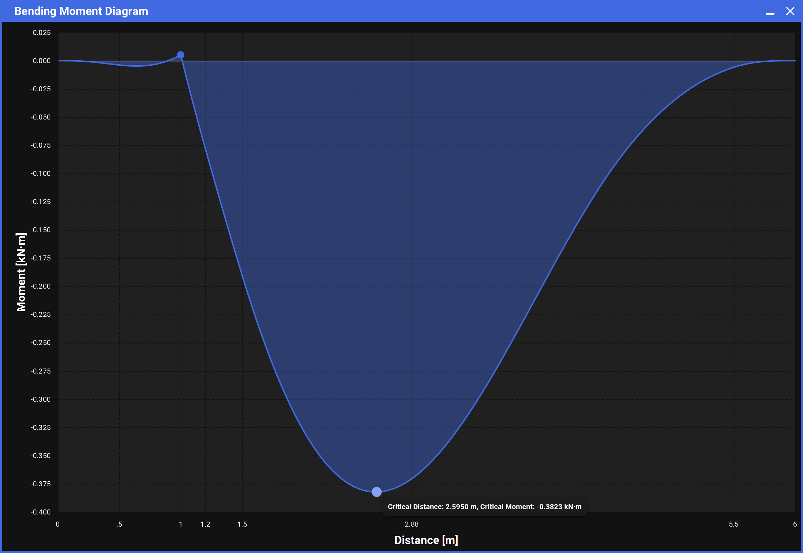

# PADDL

## About
PADDL, Precision Analysis & Design for Dynamic Loading, is a JavaFx desktop app built to simplify technical civil engineering design and analysis. The primary goal of the project is to implement effective UI/UX design to lower the barrier of technical knowledge required to make informed, analytical civil engineering decisions in less time.

PADDL is built as a custom software solution for [WECCA](https://wecca.org/), the Western Engineering Concrete Canoe Association, as our 2025 EFA (Enhanced Focus Area). PADDL's modules are designed specifically as solutions to aid civil engineering processes specifically centered around WECCA's concrete canoe.

### The Beam Module

The beam module solves for the canoe's internal shear force and bending moment distributions. This is a key factor in analyzing the structural integrity of the canoe, and validating our design choices in both construction and materials design.

<div style="display: flex; flex-direction: row;">
    
    
    <br>
    
    
</div>

Here we can see the process of solving a load case for 2024's canoe "Shark Bait". The user has added some external loads (first image), and then solves for equilibrium of the floating canoe to get an upward facing buoyancy reaction force such that the canoe is floating in static equilibrium. Picture when you step into the back of a canoe, and it both sinks down and tilt's up at the front since nobody is sitting there. This is what is meant by the canoe finding static equilibrium: the position where it's forces and moments all cancel out. From equilibrium, the user can generate corresponding Shear Force and Bending Moment diagrams (third and fourth image) which provide valuable information into the internal forces of the canoe as it floats.

### The Hull Builder Module

The origin of this module was to address concerns that a model for 2024's Shark Bait, which was originally used to develop PADDL, would lose precision in 2025 and beyond as we gradually change the hull design over the years. It seeks to solve this problem by making it simple to modify the geometry of the canoe in each of its three isometric views. At the moment, the first view (the side view) continues to be worked on, along with a suite of tools to ensure that the canoe's geometry can be easily and flexibly designed and data to show numerical implications of design choices.

<div style="display: flex; flex-direction: row;">
    
    
</div>


In the first photo, we can see the user using the knob to pull on the "handles" (points that determine the construction of the hull's curve). In the second, we see them adding points to the construction of the hull's curvature for further customization.

### The Punching Shear Module

We model punching shear forces on our canoe as the force it experiences when a paddler's knee presses down on the bottom of the hull wall where they sit. It is important that our concrete can withstand these forces for structural integrity. The punching shear module acts as an intuitive calculator for this, making it easy to work with different load cases to find the critical case, ensuring the canoe will have structural integrity in all possible races and load cases.

<div style="display: flex; flex-direction: row;">
    
    
</div>

Current work is on an intuitive glossary to lay out the equations behind the module to make its usage and purpose more clear.

### The Percent Open Area Module

This is a relatively simple module, developed as an internal tool to solve a regulatory problem enforced by the competition that WECCA competes in, the Canadian National Concrete Canoe Competition (CNCCC). Regulations are imposed by the CNCCC on our reinforcement mesh, as different types of mesh may provide an unfair advantage depending on the mesh geometry/properties as defined by the competition.

<div style="display: flex; flex-direction: row;">
    
    
</div>

This module is used by simply uploading a photo of the mesh, and then our image analysis API does the bulk of the work to determine if the mesh meets open area regulations.

### Summer '24 Development Overview:
- Mathematical models with calculus and structural engineering methodologies of the canoe
- Two Finished Scenarios to solve for the canoe's equilibrium
    - Stands Case: balance the canoe on stands at x = 0 & x = L with vertical reaction forces
    - Floating Case: numerically solve for a buoyancy load distribution at an equilibrium waterline
- Flexibility to change colors to meet different yearly themes
- Working with different units made easy
- Canoe model clearly displayed visually
- Mapping of the canoe model to a file to be downloaded & uploaded for sharing data between engineers
- Infrastructure to include other modules
- Deploy to Mac and PC (.exe / .app), downloadable at [https://wecca.org/](https://wecca.org/)

### Short - Medium Term Goals:
- Grow to include club general members as casual contributors in the '24-'25 school year
- Develop the other 5 planned structural/concrete design modules with other contributors
- Implement more program wide settings and features for convenience across modules
- More R&D into more advanced structural analysis methods to expand modelling capabilities

### Fall / Winter '24 - '25 Development Overview:
- Percent Open Area Module Developed which uses image processing algorithms to assess the compeition validity of our reinforcement mesh. This allows us to optimize its propertieis while meeting rules and standards.
- Punching SHear Module developed which organizes a set of simple equations and constants to ensure the canoe can withstand the forces it experiences from the paddlers
- Hull Builder Module developed to allow the user to easily customize the hull's geometry with simple UI and flexible UX.

### Long Term Goals
- Explore the ability to create a mesh from the 3 canoe views once the user can fully customize each of them
- Use the mesh for dynamic analysis, including vector field and differential equation modelling


## Setting up the Development Environment

1. <b>Clone the repo</b>
   ```sh
   git clone https://github.com/Tyler-Liquornik/canoe-analysis
   ```
2. <b>Build the project with Maven</b>
   ```
   maven clean install
   ```
3. <b>Install Scenebuilder</b> <br/>
   Even if you already had Scenebuilder installed, you cannot render certain JFoenix components with Scenebuilder 16+ <br/> <br/>
   
   On Windows, you can install it through chocolatey. <br/>
   If you haven't installed chocolatey before, you can do it by running a terminal as admin (right click > run as admin)
   ```
    @"%SystemRoot%\System32\WindowsPowerShell\v1.0\powershell.exe" -NoProfile -InputFormat None -ExecutionPolicy Bypass -Command "iex ((New-Object System.Net.WebClient).DownloadString('https://community.chocolatey.org/install.ps1'))" && SET "PATH=%PATH%;%ALLUSERSPROFILE%\chocolatey\bin"
   ```
   If you have chocolatey already, skip to the installation step here
   ```
   choco install scenebuilder --version=15.0.1
   ```
   
   On Mac, you can install SceneBuilder directly from <br/>
   [https://download2.gluonhq.com/scenebuilder/15.0.1/install/mac/SceneBuilder-15.0.1.dmg](https://download2.gluonhq.com/scenebuilder/15.0.1/install/mac/SceneBuilder-15.0.1.dmg) <br/> <br/>
    
4. <b>Add JFoenix and FontAwesomeFX to Scenebuilder</b><br/>
   Download [JFoenix](https://jar-download.com/artifacts/com.jfoenix/jfoenix/9.0.10/source-code) and [FontAwesomeFX](https://jar-download.com/artifacts/de.jensd/fontawesomefx/8.2/source-code) </br> <br/>

   Add the jar files to Scenebuilder's library:

   <div style="display: flex; flex-direction: row;">
    
    
   </div>

   Add the jar files from the boxed link. The list should show JFoenix and Scenebuilder as shown. </br> <br/>

5.  <b>Add VM options</b><br/>
    You need to add VM options in order to run PADDL in IntelliJ. <br/>
    ```
    --add-opens=java.base/java.lang.reflect=ALL-UNNAMED
    --add-opens=java.base/java.lang=ALL-UNNAMED
    --add-opens=java.base/java.lang.reflect=com.jfoenix  
    --add-exports=javafx.controls/com.sun.javafx.scene.control.behavior=com.jfoenix
    --add-exports=javafx.graphics/com.sun.javafx.stage=com.jfoenix
    --add-exports=javafx.base/com.sun.javafx.event=com.jfoenix
    --add-exports=javafx.base/com.sun.javafx.binding=com.jfoenix
    --add-exports=javafx.controls/com.sun.javafx.scene.control=com.jfoenix
    ```

    <div style="display: flex; flex-direction: column; width: 80%; align-items: center; justify-content: center; padding: 10px 0 10px 0">
       <br/>
      
    </div>

<!-- CONTACT -->
## Contact

Tyler Liquornik: tyler.liquornik@gmail.com

<!-- MARKDOWN LINKS & IMAGES (might use later) -->
<!-- https://www.markdownguide.org/basic-syntax/#reference-style-links -->
<!-- [contributors-shield]: https://img.shields.io/github/contributors/othneildrew/Best-README-Template.svg?style=for-the-badge
[contributors-url]: https://github.com/othneildrew/Best-README-Template/graphs/contributors
[forks-shield]: https://img.shields.io/github/forks/othneildrew/Best-README-Template.svg?style=for-the-badge
[forks-url]: https://github.com/othneildrew/Best-README-Template/network/members
[stars-shield]: https://img.shields.io/github/stars/othneildrew/Best-README-Template.svg?style=for-the-badge
[stars-url]: https://github.com/othneildrew/Best-README-Template/stargazers
[issues-shield]: https://img.shields.io/github/issues/othneildrew/Best-README-Template.svg?style=for-the-badge
[issues-url]: https://github.com/othneildrew/Best-README-Template/issues
[license-shield]: https://img.shields.io/github/license/othneildrew/Best-README-Template.svg?style=for-the-badge
[license-url]: https://github.com/othneildrew/Best-README-Template/blob/master/LICENSE.txt
[linkedin-shield]: https://img.shields.io/badge/-LinkedIn-black.svg?style=for-the-badge&logo=linkedin&colorB=555
[linkedin-url]: https://linkedin.com/in/othneildrew
[product-screenshot]: images/screenshot.png -->
