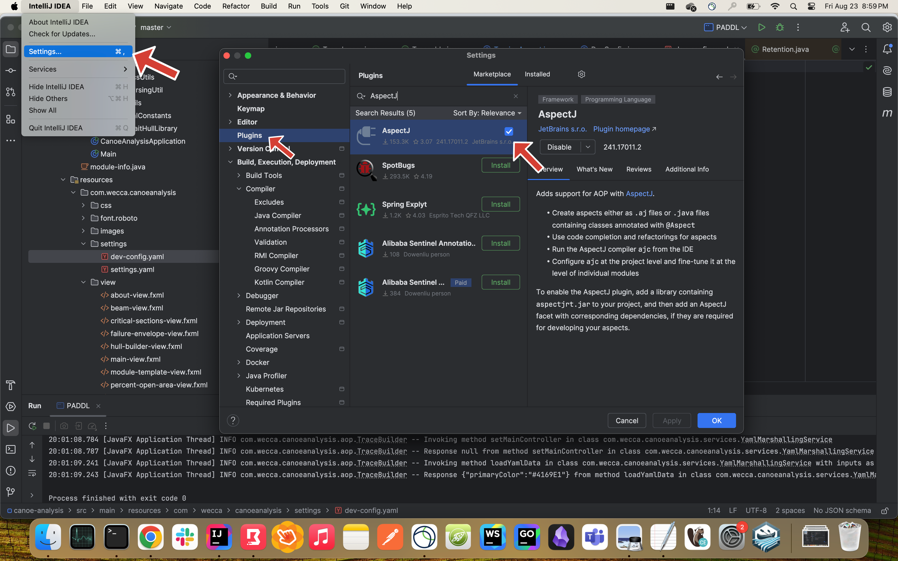

### Setting up Tracing with AspectJ

AspectJ is a special extension to java which implements the AOP (Aspect Oriented Programming) paradigm.  
AspectJ requires its own compiler, ajc to be used in tandem with the standard java compiler, javac  
With AspectJ, a powerful, customizable tracing featured built into PADDL can be enabled for an enhanced debugging developer experience  
The plugin for AspectJ requires IntelliJ Ultimate. It is complete opt-in and PADDL should build, compile, deploy, and run fine without it.  

        

 
<b>a) Install the AspectJ plugin </b>

        

 
<b>b) Select the ajc compiler</b>

        

 
<b>c) Enable post-compile weave mode</b>

        

 
<b>d) Customize tracing behaviour</b>  
run <code>maven clean install</code> to build once, then change the <code>tracing</code> property in <code>dev-config.yaml</code> to enable or disable tracing.  
Use <code>@Traceable</code> and <code>@TraceIgnore</code> for fine-grained customization on which methods are traced.

        

